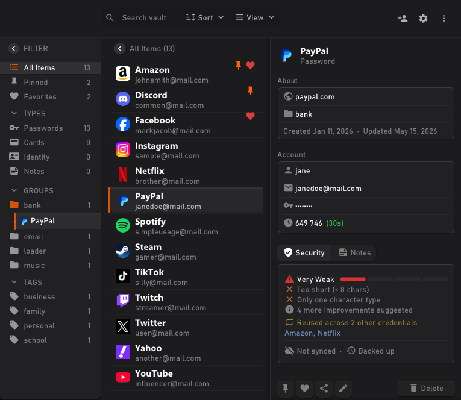
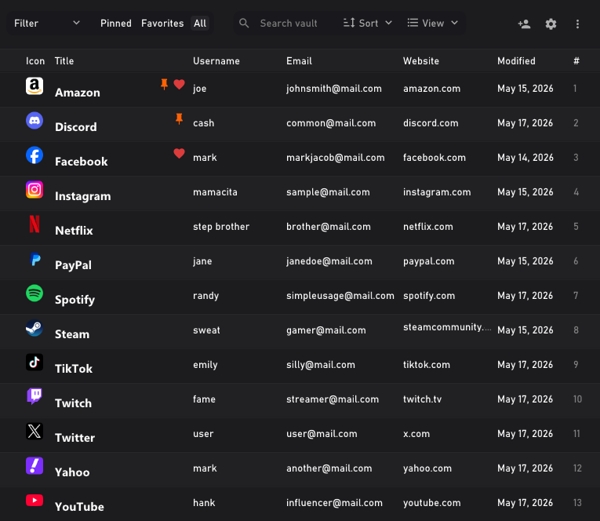
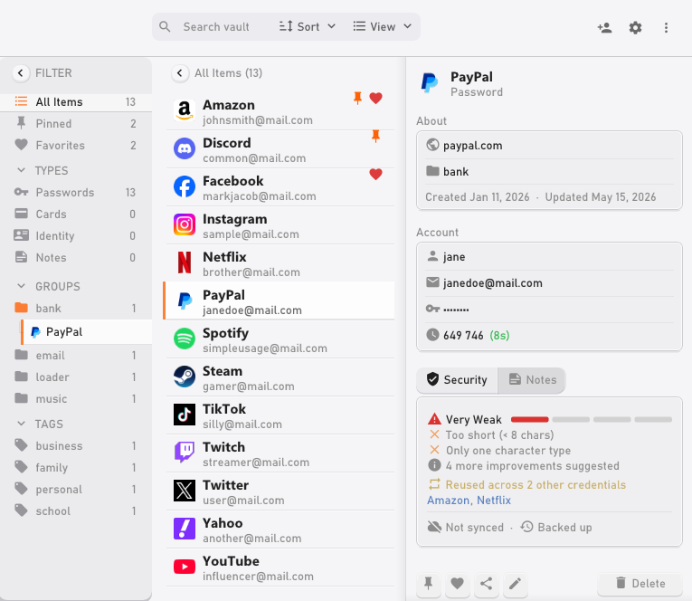

# Password Defense

A zero-knowledge, **fully offline** password manager built with C++ and ImGui. Your master password never leaves your device — all encryption happens locally using XChaCha20-Poly1305 and Argon2id. The app makes **no network connections by default**; the only two features that can reach the internet are opt-in and OFF until you enable them (see [Network & Privacy](#network--privacy)).

## Screenshots



| Table view | Light theme |
| --- | --- |
|  |  |

## Features

### Vault & Credentials
- 4 credential types: Passwords, Credit Cards, Identity Documents, Secure Notes
- Unlimited vaults with tabbed multi-vault interface
- Password history (up to 5 per credential), custom groups, pin & favorite
- Soft-delete trash (30-day recovery), credential expiry timers
- 128-level undo history

### Security & Encryption
- **XChaCha20-Poly1305** authenticated encryption (per-credential)
- **Argon2id** key derivation with optional high-security mode (4 iterations / 1 GB RAM)
- AAD-binding (per-credential UUIDs prevent ciphertext-swap attacks; vaults from before AAD binding are re-encrypted on their first unlock)
- Memory pinning, secure zeroing, master password re-prompt
- Auto-lock, clipboard auto-clear, lockout protection, self-destruct on exit

### Security Center
- Weak password detection (entropy scoring + pattern analysis)
- Reused password detection across all credentials
- Optional breach checking via Have I Been Pwned (opt-in, OFF by default; k-anonymity — passwords never leave your machine)
- Password aging alerts (configurable threshold, default 90 days)
- At-a-glance dashboard with one-click navigation to fix

### Two-Factor Authentication
- TOTP support with live countdown
- QR code setup, recovery codes (8 one-time-use), recovery key (with 2FA on, the recovery key also needs a 2FA code)

### Password Generator
- Configurable length and character sets
- Avoid ambiguous characters option
- Real-time strength meter (0–4 entropy score)

### Views & Layout
- 5 view modes: Simple Rows, Detailed Rows, Tile Grid, Three-Pane, Table
- Dark & Light themes with custom card background colors
- Hover-expand, customizable pill tabs, configurable columns
- Per-type subtitles, row gap control, collapsible three-pane panels

### Search, Filter & Sort
- Real-time search by title, email, or username
- Type filters, multi-select group filters
- Sort by title, created date, or updated date
- 6 grouping modes: None, Group, Month Created, Month Updated, Pinned & Favorites, Alphabetical

### Input Formatting
- Auto-formatted card numbers, expiry dates, phone numbers, dates of birth
- Digit-only filtering, smart cursor navigation, clean raw-digit storage

### Backup & Restore
- Automatic backups on every save
- Manual backup creation, configurable retention (default 25)
- Browse & restore from any `.lbdb` snapshot

### Import & Export
- **Export**: CSV (Bitwarden/Chrome compatible), PWM (native encrypted), KDBX (KeePass)
- **Import**: CSV (auto-detect Bitwarden, KeePass, LastPass, 1Password), PWM with conflict detection

### Network & Privacy
- **Fully offline by default** — no sync, no servers, no telemetry, no outbound connections
- Two opt-in online features, both OFF until you enable them in **Settings → Security → Network & Privacy**:
  - **Website Icons** — fetch site favicons on demand (lazily, only for entries shown)
  - **Online Breach Check** — Have I Been Pwned k-anonymity lookup (no password sent)
- Favicon cache transparency: live on-disk size/count readout with one-click **Clear**
- Disabling favicons stops all new fetches; already-cached icons keep working offline

### Desktop Integration
- System tray (minimize/close to tray, right-click menu)
- Start on boot, start minimized, always-on-top
- Auto-open last vault, read-only mode

## Platform

- Windows 10/11
- Portable single executable — no install required
- DirectX 11 hardware-accelerated UI

## Build

Built with Visual Studio 2022 (toolset v143, C++20). The build config is **Release | x64**.

**Prerequisites**
- Visual Studio 2022 with the *Desktop development with C++* workload
- Windows 10/11 SDK (installed with that workload — provides `d3d11.h`, `d3dcompiler.h`, `winhttp.h`)

**Dependencies**
- **Vendored, no action needed**: Dear ImGui, stb_image, nlohmann/json, and the SQLite amalgamation in `third_party/`; qrcodegen in `tools/`.
- **libsodium** — the one external dependency you supply. Download the prebuilt MSVC build (`libsodium-<version>-stable-msvc.zip`) from <https://download.libsodium.org/libsodium/releases/> and extract it into a `libs\libsodium\` folder at the repo root, so the layout is:
  ```
  libs\libsodium\include\sodium.h
  libs\libsodium\x64\Release\v143\static\libsodium.lib
  ```
  (`libs\` is gitignored.) The project links `libsodium.lib` statically (`SODIUM_STATIC` is already defined).

**Steps**
1. Place libsodium as above.
2. Open `PasswordDefense.sln` in Visual Studio 2022.
3. Select **Release | x64** and Build (F7).
4. The executable is written to `x64\Release\Password Defense.exe`.

## License

MIT
